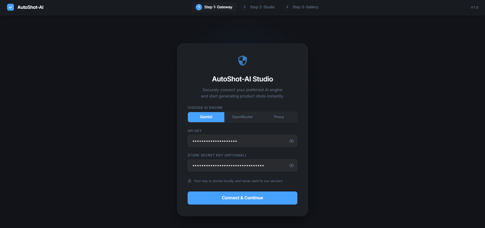
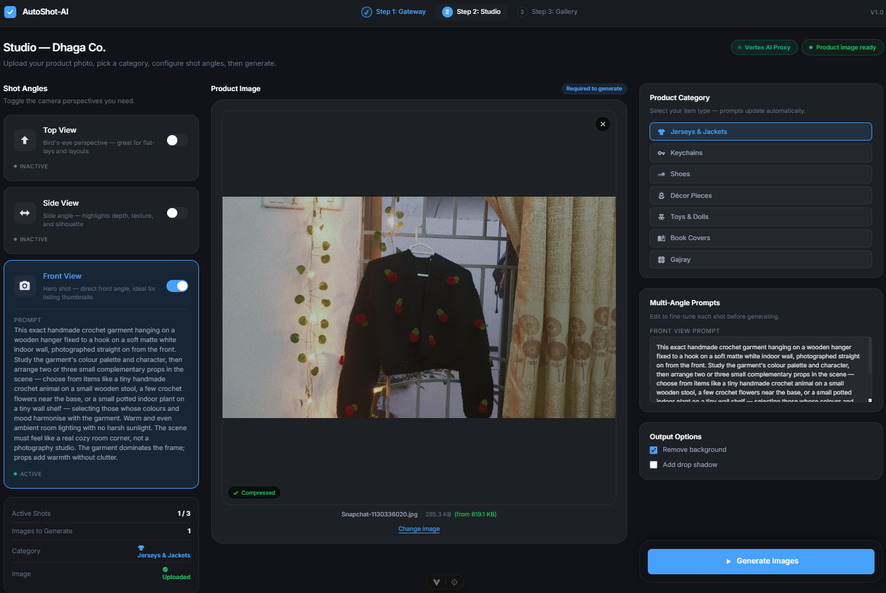
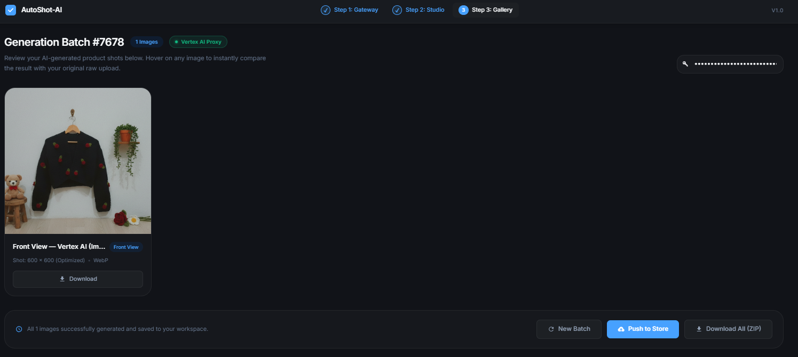
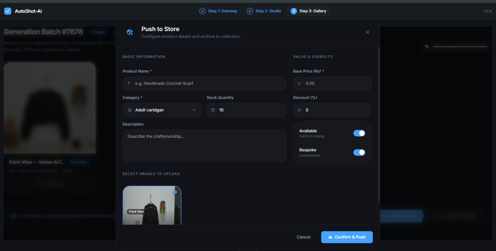

# AutoShot AI — E-Commerce Smart Studio

AutoShot AI is an automated, AI-powered product photography studio. It helps e-commerce sellers turn simple, raw photos of handmade items into high-quality, professional marketing shots with custom backgrounds and matching props—all in just a few clicks.

---

## What is AutoShot AI?

Instead of manually editing backgrounds or spending hours prompting AI chat models to place your products in a nice setting, AutoShot AI automates the entire process. 

1. **Select a Category**: Choose your product type (like jerseys, keychains, toys, or shoes).
2. **Upload & Auto-Prompt**: Upload your raw product photo. The app automatically injects specialized, highly detailed prompts customized for that category.
3. **Generate**: Click the generate button to get multiple professional angles (Top, Side, and Front views).
4. **Publish Directly**: Tap "Publish", fill in a quick form with the price and description, and send the product straight to your live e-commerce store!

---

## Key Modules

The application is built around a smooth, **3-step pipeline**:

### 1. 🔑 API Gateway (Auth & Setup)
Configure how you want to connect to AI engines. To protect sensitive credentials and save on costs, AutoShot AI supports multiple providers, including a custom secure proxy.

### 2. 📸 Generation Studio
The creative workspace where you:
* Select a product category (which loads smart, context-aware props and settings).
* Upload your raw product photo.
* Review or tweak the auto-generated prompts.
* Select your preferred angles (Front, Side, or Top view) and generate.

### 3. 🖼️ Export Gallery
The publishing and downloading dashboard where you can:
* View all generated, high-resolution product photos.
* Download individual optimized shots or package them into a single `.ZIP` file.
* Open the **Publish Form Modal** to enter pricing, product name, and description, then publish it directly to your main front-end store for real customers to see!

---

## Visual Walkthrough

Here is a visual guide of the application's key steps:

### Step 1: The API Gateway

*Set up your credentials securely. Choose between direct Gemini API, OpenRouter, or the custom Vertex AI Proxy.*

### Step 2: The Photo Studio

*Upload your product, select its category (which automatically tailors the prompts), choose your camera angles, and start generating.*

### Step 3: The Export Gallery

*Browse your professional outputs, download your favorites, or bundle them together in one click.*

### Step 4: Direct Publishing to Store

*Fill out the product information form inside the modal to push your newly generated professional listings directly to the active online store.*

---

## Behind the Scenes: AI Providers & The Proxy Server

To make image generation flexible and budget-friendly, the app supports three providers:

* **Google Gemini API**: Directly connects to Gemini's advanced multimodal image-generation engines (like `gemini-3.1-flash-image-preview`) to output high-fidelity product images.
* **OpenRouter**: Included as a market standard to offer model flexibility. It allows users to experiment with different AI models (such as `google/gemini-2.5-flash`) by routing requests through a single gateway.
* **Vertex AI Proxy Server**: Built specifically to securely access **Vertex AI** and take advantage of free hosting credits. Since putting API keys directly in a browser application is unsafe, the custom proxy server handles all authentication and routes requests safely without exposing keys.

---

## Technology Stack & Dependencies

AutoShot AI is built using modern, lightweight, and fast web technologies:

* **Core Framework**: [Vue 3](https://vuejs.org/) (utilizing the reactive Composition API).
* **Build Tool & Server**: [Vite](https://vite.dev/) (for ultra-fast page loads and optimized builds).
* **Styling**: [Tailwind CSS v4](https://tailwindcss.com/) (modern utility classes for fully responsive, beautiful layouts).
* **Routing**: [Vue Router v5](https://router.vuejs.org/) (drives the linear 3-step navigation flow).
* **Key Frontend Libraries**:
  * `@iconify/vue` — High-quality modern icon system.
  * `browser-image-compression` — Automatically compresses heavy image uploads and generated assets in the browser.
  * `jszip` & `file-saver` — Bundles generated images into a single ZIP file for seamless downloads.

---

## Getting Started

### Prerequisites
Make sure you have the following installed on your system:
* [Node.js](https://nodejs.org/) (Version `20.19.0` or `>=22.12.0`)
* npm (bundled with Node.js)

### Installation Steps

1. **Clone the repository and go to the project directory**:
   ```bash
   cd autoshot-ai
   ```

2. **Install all dependencies**:
   ```bash
   npm install
   ```

3. **Start the development server**:
   ```bash
   npm run dev
   ```
   *The server will launch. Open the provided address (usually `http://localhost:5173`) in your browser.*

---

## Code Quality & Production

Keep the project clean and build-ready using these commands:

* **Format Code**: Clean up code spacing and format using Prettier:
  ```bash
  npm run format
  ```
* **Lint Code**: Check for code errors or standard violations using oxlint and eslint:
  ```bash
  npm run lint
  ```
* **Production Build**: Compile and minify the application to prepare it for deployment:
  ```bash
  npm run build
  ```
